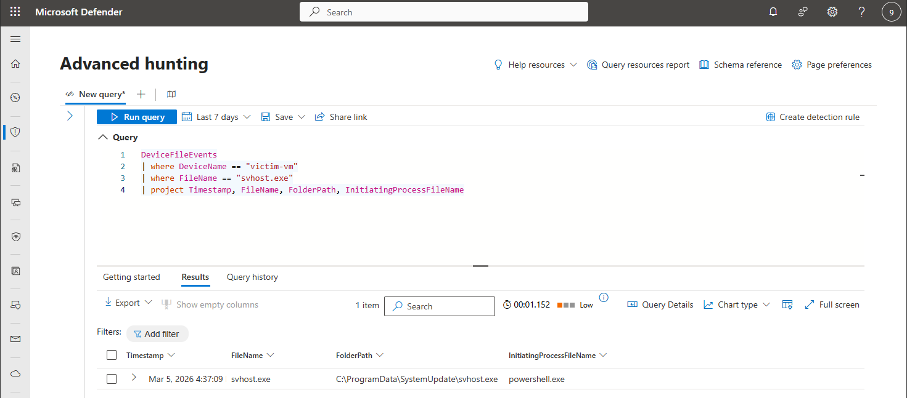
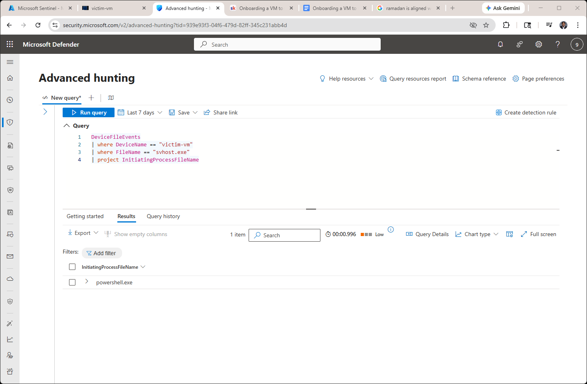
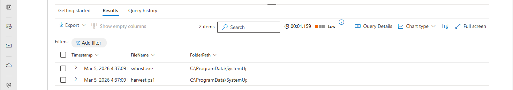
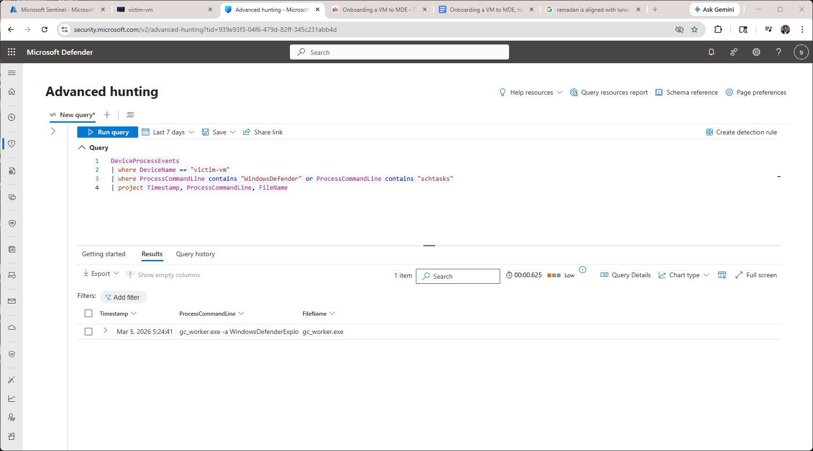
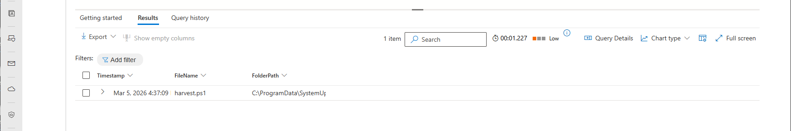

# 🎯 Threat Hunt Scenario - "The Silent Persistence"

A threat hunting investigation using Microsoft Defender for Endpoint and KQL queries.

## Scenario Overview

Discovered malware on a system that established multiple persistence mechanisms. Using advanced hunting in Microsoft Defender, I traced the attack chain and identified 5 key indicators of compromise.

---

## 5 Flags Found

### Flag 1: Malware Binary
**Query:**
```kql
DeviceFileEvents
| where DeviceName == "victim-vm"
| where FileName == "svhost.exe"
| project Timestamp, FileName, FolderPath, InitiatingProcessFileName
```
**Answer:** `svhost.exe` at `C:\ProgramData\SystemUpdate\svhost.exe`



---

### Flag 2: Creator Process
**Query:**
```kql
DeviceFileEvents
| where DeviceName == "victim-vm"
| where FileName == "svhost.exe"
| project InitiatingProcessFileName
```
**Answer:** `powershell.exe`



---

### Flag 3: All Files Created
**Query:**
```kql
DeviceFileEvents
| where DeviceName == "victim-vm"
| where FolderPath contains "SystemUpdate"
| project Timestamp, FileName, FolderPath
| order by Timestamp asc
```
**Answer:**
- svhost.exe
- harvest.ps1



---

### Flag 4: Scheduled Task
**Query:**
```kql
DeviceProcessEvents
| where DeviceName == "victim-vm"
| where ProcessCommandLine contains "WindowsDefender" or ProcessCommandLine contains "schtasks"
| project Timestamp, ProcessCommandLine, FileName
```
**Answer:** `WindowsDefender` task scheduled daily at 3 AM



---

### Flag 5: Harvest Script
**Query:**
```kql
DeviceFileEvents
| where DeviceName == "victim-vm"
| where FileName == "harvest.ps1"
| project Timestamp, FileName, FolderPath
```
**Answer:** `harvest.ps1` at `C:\ProgramData\SystemUpdate\harvest.ps1`



---

## Attack Chain

1. PowerShell deployed malware binary (svhost.exe)
2. Registry persistence added via Run key (SystemUpdateService)
3. Scheduled task created for daily execution (WindowsDefender)
4. Credential harvesting script enumerated system
5. Data staged for exfiltration

---

## Key Findings

- Malware masqueraded as legitimate Windows service
- Multiple persistence mechanisms (registry + scheduled task)
- Scheduled task ensures execution independent of user login
- System information actively harvested

---

## MITRE ATT&CK Framework

**Techniques Used:**
- T1059.001 - Command and Scripting Interpreter: PowerShell
- T1547.001 - Boot or Logon Autostart Execution: Registry Run Keys
- T1053.005 - Scheduled Task/Job: Scheduled Task
- T1036.005 - Masquerading: Match Legitimate Name or Location
- T1082 - System Information Discovery

---

## Tools

- Microsoft Defender for Endpoint
- Kusto Query Language (KQL)
- Azure Virtual Machines
